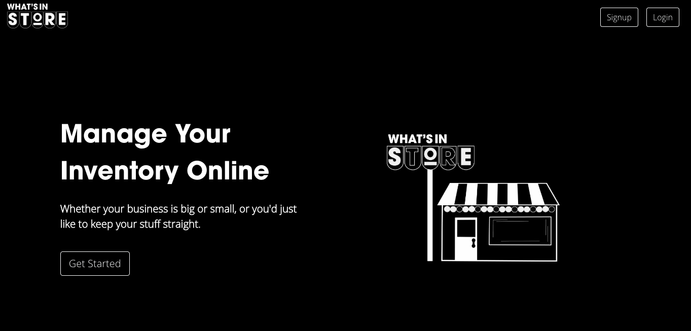

# What's In Store

What’s In Store is a tool for people to manage their inventories online. This app allows people to track their inventories, sales, and promotions. They may add and edit products, details, stock, and search their inventory by customizable categories and subcategories. They may track sales for each item and across all inventory, made easy with visual representations on their dashboard. This app will also allow people to set and follow their promotional sales: per item, price change, and time period.

 

## Getting Started

First, go to http://www.whats-in-store.net and on the left-hand side of the webpage, click `Get Started`. From here you will be prompted to set up your login credentials and shop information. Thereafter you will be redirected to your dashboard, which will eventually provide users with a visual representation of all stock and sales. As new users will not yet have an inventory to track, they are prompted here to add one. Users may easily navigate the website by clicking the navigation icon in the upper right-hand corner. 

### Prerequisites

Using this web portal requires no installation, though you may want to have an inventory in mind to add [and sales to track] in order to see the full potential of our What's In Store website. 

## Notable Code Snippets

Please see our code snippets on CSS Animation, Add/Edit Variant, Categories, and Subcategories, filtering, and sorting below. 

### 1. CSS Animation

We created an animated shop using CSS animation properties. The animation uses keyframes to sequence through animation sequences, and the fade value to cycle through each components of the animation. Each keyframe uses a different opacity ranging from 0% to 100% to progress, as well as animation delays to time when each piece should start.

client/src/App.css

~~~~
.landingImage{
    padding: 0px, 0px, 0px, 0px;
    margin: 0px, 0px, 0px, 0px;
}

.fadein{
    justify-content: center;
    display: flex;
    height: 10vw;
    position: absolute;
    bottom: -60px;
    left: 200px
}
.fadein img {
    object-fit: scale-down!important;
    position:absolute;
    animation-name: fade;
    animation-iteration-count: infinite;
    animation-duration: 1.5s;
  }
  
  @keyframes fade {
    0% {opacity: 0}
    20% {opacity: 1}
    33% {opacity: 1}
    53% {opacity: 0}
    100% {opacity: 0}
  }
  ~~~~

###  2. Add/Edit Variant, Categories, and Subcategories 

These functions are using similar code. We used spread syntax to do add and updatee. The original codes are in client/src/pages/inventory.js

~~~~
updateVariant = (varientIndex, field) => value => {
    this.setState(
        {
            stock: this.state.stock.map((item, i) => i === varientIndex ? { ...item, [field]: value } : { ...item })
        }
    )
}
addVariant = () => {
    this.setState({
        stock: [...this.state.stock, { ...emptyVariant }]
    })
}
~~~~

### 3. Filtering

The logic of the filtering is get all product data from our database and save them in state on inventory page. At the same time we created a "filters" object on our state keeping category_id: true/false pairs inside. When a user check/uncheck a category, the function below will be triggered to reset the the value of a specific category id from true to false (or vice versa). Then, we call the handleSortedDom function which keeps tracking of the filters to fill the "filteredProducts" array on the state with products that belong to that specific category. The original codes are on client/src/pages/inventory.js

~~~~
handleCheckBox = (e) => {
        // get the checked cats's id 
        if (e) {
            const { name, checked } = e.target

            this.setState(prevState => {
                //set state with previous state key/value and change the checked key/value
                const filters = { ...prevState.filters, [name]: checked }

                // return the id of cats whose value is true
                const filteredCatsIds = Object.keys(filters).filter(
                    // condition: keys of filters obj which value is true (has been checked)
                    filterKey => filters[filterKey]
                )
                // filter the products arr in state with the filteredCatsIds
                const filteredProducts = prevState.products.filter(product =>
                    filteredCatsIds.some(
                        // condition checked catsId equal to product category id
                        filteredCatsId => filteredCatsId === product.category
                    )
                )
                return {
                    // return filters to actively monitor checkbox
                    filters,
                    // return the filtered products belonging to the checked cats
                    filteredProducts
                    
                }
            },()=>this.handleSortedDom())
        }
        else {
            this.setState(prevState => {
                //set state with previous state key/value and change the checked key/value
                const filters = { ...prevState.filters }

                // return the id of cats whose value is true
                const filteredCatsIds = Object.keys(filters).filter(
                    // condition: keys of filters obj which value is true (has been checked)
                    filterKey => filters[filterKey]
                )
                // filter the products arr in state with the filteredCatsIds
                const filteredProducts = prevState.products.filter(product =>
                    filteredCatsIds.some(
                        // condition checked catsId equal to product category id
                        filteredCatsId => filteredCatsId === product.category
                    )
                )
                return {
                    // return the filtered products belonging to the checked cats
                    filteredProducts
                    
                }
            })
        }
    }
~~~~

### 4. Sorting

The handleSorting function will keep track of the dropdown on inventory page and set the "sorting" state with the keywords of how we're going to sort the products (like price from low to high, for example). After we set the state, we call the handleSortedDom function which is basically a switch that take in the filteredProducts array and sort the products inside according to the keywords, and finally reset the filteredProducts array. The original codes are on client/src/pages/inventory.js
~~~~
handleSorting = (e) => {
        const { name, value } = e.target
        console.log(name)
        console.log(value)
        // set state
        this.setState({
            [name]: value
        },()=>{
            this.handleSortedDom()
        })
    }
   
handleSortedDom = ()=>{

    let products = [...this.state.filteredProducts]
    switch (this.state.sorting) {

        case "priceLtoH":
            console.log("ranging the dom priceLtoH")
            products.sort((a, b) => (a.price - b.price))
            console.log(products)
            this.setState({
                filteredProducts: products
            })
            break;

        case "priceHtoL":
            console.log("ranging the dom priceHtoL")
            products.sort((a, b) => (b.price - a.price))
            console.log(products)
            this.setState({
                filteredProducts: products
            })
            break;

        case "stockLtoH":
            console.log("ranging the dom stockLtoH")
            products.sort((a, b) => (a.totalStock - b.totalStock))
            console.log(products)
            this.setState({
                filteredProducts: products
            })
            break;

        case "stockHtoL":
            console.log("ranging the dom stockHtoL")
            products.sort((a, b) => (b.totalStock - a.totalStock))
            console.log(products)
            this.setState({
                filteredProducts: products
            })
            break;

        case "NameAtoZ":
            console.log("ranging the dom NameAtoZ")
            products.sort((a, b) => (a.name.toLowerCase() > b.name.toLowerCase() ? (1) : (-1)))
            console.log(products)
            this.setState({
                filteredProducts: products
            })
            break;

        case "NameZtoA":
            console.log("ranging the dom NameZtoA")
            products.sort((a, b) => (a.name.toLowerCase() > b.name.toLowerCase() ? (-1) : (1)))
            console.log(products)
            this.setState({
                filteredProducts: products
            })
            break;
        default:
            console.log("ranging the dom by default")
            this.handleCheckBox()
    }
}
~~~~

## Repository on Github

https://github.com/jakescheele/whats-in-store

## Deployment 

http://www.whats-in-store.net 

## Built With

* [Node](https://www.npmjs.com/get-npm) - Installs package.json and node.modules that the application depends on
* [Node-Express](https://www.npmjs.com/package/express) - Used to establish routes
* [JQuery](https://code.jquery.com/) - Our Javascript library
* [Axios](https://www.npmjs.com/package/axios) - Used to make http requests from node.js 
* [Morgan](https://www.npmjs.com/package/morgan) - Used as a HTTP request logger middleware for node.js
* [Dotenv](https://www.npmjs.com/package/dotenv) - Installed to read our .env files for secret keys
* [If-env](https://www.npmjs.com/package/if-env) - Used to simplify development and be able to run npm start in all environments & run the correct scripts
* [Express](https://www.npmjs.com/package/express) - Used for routing in node
* [Express-form-data](https://www.npmjs.com/package/express-form-data) - Used to parse multipart form data
* [Express-session](https://www.npmjs.com/package/express-session) - Used to save session data in a session ID, server-side
* [Bootstrap](https://getbootstrap.com/docs/4.3/getting-started/introduction/) - Used for styling our front-end
* [React-Bootstrap](https://react-bootstrap.github.io/) - Used for styling our front-end as a react application
* [React-Build](https://www.npmjs.com/package/react-build) - Used as a zero-configuration packager and debug server for React components 
* [React-Moment](https://www.npmjs.com/package/react-moment) - Used to manipulate how we display dates back to the user
* [Mdbreact](https://www.npmjs.com/package/mdbreact) - Used for React Bootstrap with Material Design
* [Yarn](https://www.npmjs.com/package/yarn) - Used for secure dependency management
* [React](https://facebook.github.io/create-react-app/docs/getting-started) - Used for developing components and a build setup with no configuration.
* [MongoDB](https://www.mongodb.com/download-center/community) - Used to access data directly from your frontend code
* [MongooseJS](https://mongoosejs.com/) - Used for mongodb object modeling for node.js
* [Compass](https://www.mongodb.com/products/compass) - Used to more easily interact with our MongoDB data 
* [Mongoose-bcrypt](https://www.npmjs.com/package/mongoose-bcrypt) - Plugin used for encrypting fields with bcrypt and providing methods to encrypt and verify
* [Passport](http://www.passportjs.org/docs/) - Middleware used for user authentication with Node
* [Passport-local](https://www.npmjs.com/package/passport-local) - Used for authenticating with a username and password with Passport
* [Cookie-Parser](https://www.npmjs.com/package/cookie-parser) - Used to prepare cookies so Passport can authenticate our users
* [Bcrypt](https://www.npmjs.com/package/bcrypt) - Used to hash all of our passwords in the database
* [Cloudinary](https://cloudinary.com/documentation/solution_overview) - Used to store images in the cloud
* [Multer](https://www.npmjs.com/package/multer) - Middleware for handling multipart form data, used for uploading files
* [Multer-storage-cloudinary](https://www.npmjs.com/package/multer-storage-cloudinary) - Used as a multer storage engine for Cloudinary
* [Concurrently](https://www.npmjs.com/package/concurrently) - Used to run multiple commands concurrently

## Authors

* **Jake Scheele** - [jakescheele] (https://github.com/jakescheele)

* **Emily Casale** - [ercasale97] (https://github.com/ercasale97)

* **Hannah Schuelke** - [HannahSchuelke] (https://github.com/HannahSchuelke)

* **Yuwen Li** - [muzlee1113] (https://github.com/muzlee1113)

* **Jon Hernandez** - [Jonathan169] (https://github.com/Jonathan169)
